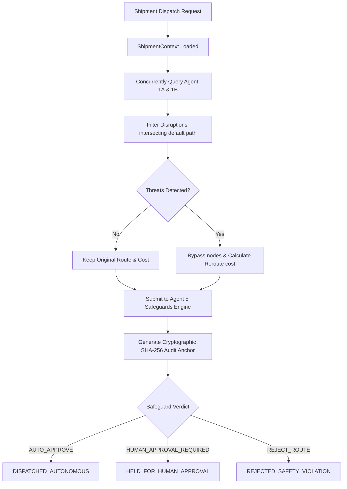

# Agent 0 — Master Orchestrator & Autonomous Dispatch Engine Specification

## Overview & Role
Agent 0 is the **Orchestration Layer** of HOP 2026 // Scalar. It executes the entire multi-agent Directed Acyclic Graph (DAG) for incoming container routing requests. 

It fans out threat requests to perception parsing modules (Agent 1A & 1B), aggregates alerts intersecting active transit corridors, calculates cost/route deviations, and routes the proposal through the deterministic Risk Safeguard Engine (Agent 5) to anchor cryptographic verification hashes.

---

## Orchestration Lifecycle DAG


---

## State Transition Payload Forms

### 1. ShipmentContext (Input Payload)
```json
{
  "container_id": "CNTR-SHA-BOM-9921",
  "origin_node": "PORT_SHANGHAI_01",
  "destination_node": "PORT_ROTTERDAM_02",
  "cargo_type": "HAZMAT_CLASS_3_FLAMMABLE",
  "is_hazmat": true,
  "baseline_cost_usd": 42000.0,
  "sla_deadline_epoch": 1787349283,
  "default_corridor_path": [
    "PORT_SHANGHAI_01",
    "CORRIDOR_TAIWAN_STRAIT",
    "PORT_ROTTERDAM_02"
  ]
}
```

### 2. OrchestrationResult (Output Payload)
Includes `audit_hash` (binding container ID, proposed cost, decision, and risk level) and `execution_status`:
- `DISPATCHED_AUTONOMOUS`
- `HELD_FOR_HUMAN_APPROVAL`
- `REJECTED_SAFETY_VIOLATION`

---

## Cryptographic Audit Signature
To guarantee complete accountability, we generate a deterministic SHA-256 hash at the end of each run:
$$H = \text{SHA256}(\text{container\_id} + \text{decision} + \text{proposed\_cost} + \text{risk\_level})$$
This signature binds the inputs and outputs, serving as a verification anchor on the blockchain registry.

---

## Tejas's RL Module Integration Guide
To swap this heuristic planner with the Graph-RL Pathfinder (Agent 2) and Constraint Validator (Agent 3):
1. Replace the bypass loop in `MasterOrchestratorAgent.run_shipment_mission` (Step 3) with an async call to `Agent2.get_optimal_path(context)`.
2. Ensure Agent 2 returns a standard `List[str]` path and proposed cost.
3. Feed the outputs directly into `self.agent_5.evaluate_plan`.
