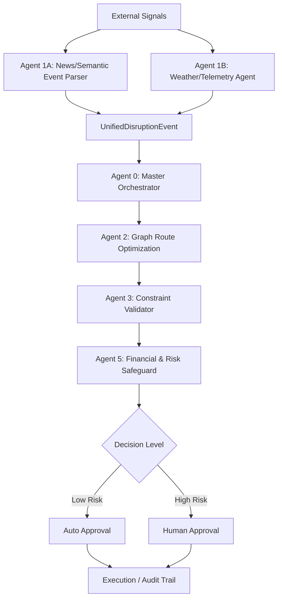

# System Architecture

## Pipeline Flow

The system ingests signals, standardizes them, calculates alternative routing options, validates logical constraints, and routes the proposed plans through deterministic financial/risk gates.

## Shiva's Scope & Ownership
- **Agent 1A (Semantic News Parser)**: Extract disruption metadata from news alerts.
- **Agent 1B (Weather & Telemetry Agent)**: Parse environmental telemetry data.
- **Agent 5 (Financial & Risk Safeguard)**: Verify plan costs, SLA exposure, HazMat, and risk thresholds.
- **Shared Contracts & Integration Adapters**: Shared interface contracts to ensure clean communication with other agents.
- **Testing**: Test suite coverage for all Shiva-owned modules.

## Determinism Guarantees
To prevent hallucinations or unpredictable routing behavior:
- **Routing & Cost Calculations**: Solved deterministically via graph optimization algorithms.
- **Safety & Policy Constraints**: Validated using strict deterministic threshold checks (e.g., maximum cost increases, SLA breach calculations, and HazMat limitations). LLMs are utilized solely for extraction (1A/1B) and narrative justifications (5), but they cannot override safety rules.
